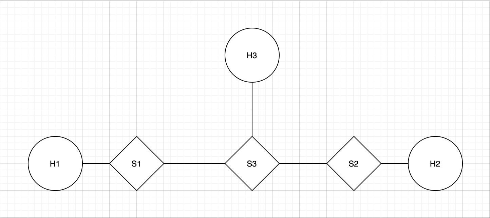

I still need to modify this to fit with what I've done. -max

# Masters Project

A system capable of registering traffic flows and intercepting traffic at the switch level to reroute it to a
[Spines](http://spines.org/) backbone. When traffic comes out of the backbone, it's delivered to its intended
destination. The goal is to accomplish this with minimal user intervention.

## Components

The project has three parts: the controller, a set of agents and Spines nodes, and programmed switches. All these
parts work together to accomplish the goal described above.

### Programmable Switches

A switch needs to be capable of detecting traffic going from node A to node B at specific ports. Additionally, a
switch needs to re-route traffic to a specific port in node C, which hosts an instance of an agent. Finally,
a switch needs to be able to detect traffic coming from the agent in node C with A as destination A and have node
A believe the traffic came from node B. To accomplish this, [P4](https://p4.org/) was used to program switches to
deconstruct packets into ethernet headers, IPv4 headers, TCP/UDP, TCP options if necessary, and the payload.

Fundamentally, the job of a switch is to decide where to send the traffic it receives next. That is, given an
IP address, what is this packet's next hop. In P4, this is done by setting the next device's mac address in
the ethernet packet, setting the egress port of the switch the packet should come out of, and decreasing
the TTL in the IP header. Because we're modifying a field in the IP header, the checksum needs to be recalculated
as well.

Per the requirements, the switch's next job is to re-route traffic when necessary. A switch knows it needs to
re-route traffic when it comes from node A and it's going to a specific port of node B, as defined by a flow.
Every time a new flow is created a new flow we install a set of rules into a routing table the switch can
access. When a packet arrives, the switch inspects the deconstructed packet, matching address and port fields
in the IP and TCP/UDP headers, respectively. If an incoming packet matches one of the existing rules, the
destination address and port are replaced to match the agent we want to forward the packet to. Additionally
the next hop mac and egress port values are set to send the packet towards the agent instance. Because we've
modified a value in the TCP/UDP header, we need to recompute the checksum.

Finally, a switch needs to be able to modify the source address and port of a packet to trick node A to believe
the packet came from node B instead of the agent in node C. This process is the same as the one described above,
but in reverse: a packet with node A as the destination and node C as the source will still be forwarded to A,
but if the source port happens to be the agent's, the source address and port will be replaced with B's.

### Agent

Originally, the idea was to have a router to not only re-route incoming traffic to the spines backbone, but also
to adapt the traffic to what a Spines node expects. A spines node receiving traffic requires packets to have
specific application headers. Having the requesting application include those application headers, though, would
violate the minimal intervention clause, so the first attempt at adding them involved having the switch adding
them. This turned out to be a problem, since making a header larger meant that a whole lot of state needed to be
kept in the switch to map sequence numbers back and forward. Switches are not built for thi, so, had it been
possible to do, this kind of computation would have certainly hurt line speed.

In light of this, we decided to add this component in between the switch and the spines node. Agents are compiled
against Spines to take advantage of its library, which provides a set of functions to deliver traffic to Spines
the way Spines understands traffic. An agent is capable of opening inbound (traffic that goes into Spines) and
outbound (traffic coming out of Spines) connections. The former acts as an interface between the sender and spines:
it takes traffic and sends it to spines. The latter extracts traffic from spines and directs it to its original
destination. These always come in pairs.

### Manager

A manager coordinates flow creation. This is the only component a client talks to and, ideally, supports two
operations: register flow and delete flow. When a client requests a flow to be created, the manager needs to
make sure a number of things happen:

- Appropriate in and out spines nodes are selected (currently there's only one).
- An inbound and outbound connections are started in their agents.
- Switch forwarding and rerouting rules are installed in the client's switch.

Once those things have happened, the client can start sending traffic.

In the original specification, the agent would keep track of a topology of clusters with machines with Spines nodes,
creating and selecting overlays given the client's latency and bandwidth requirements. We wound up abandoning this
part of the project in favor of rerouting and solving all the challenges it presented.

### Switch Controller

One of the limitations of mininet is that I couldn't find a way to talk to the switches within the virtual
environment. Because of this, I needed to give the manager the ability to communicate with an external entity
running in the host OS (or yet another VM in my case). The way this was done was by having the manager write
requests to the filesystem. This requests will be picked up by the controller, which will then be in charge of
reprogramming the switch. This is just some duct tape I needed to put on to get the system to work in my
environment, but this is not intended to be the case in production grade software.

Currently, the controller takes requests in this format:

```
switch_address:runtime_port
client_ip
client_mac
agent_ip:agent_port-destination_ip:destination_port
```

When run, the controller will look for files starting with `r`, process the above information, generate a brand
new p4 file with the provided rerouting rule, compile the generated file, and install it in the switch. Ideally,
the network manager would install and remove specific rules in the switch when creating and removing flows,
respectively. This requires the manager to interface with the [P4Runtime](https://github.com/p4lang/p4runtime)
API directly. The set of tools that I used to interface with the mininet switches were written in python; after
careful consideration, I decided against reverse-engineering them to be able to install specific rules in the
switch, as the goal is to have them integrated into a self contained network manager.

## Testbed

To develop and test the system, I used a three host, three switch mininet topology:



In this topology, hosts 1 and 2 can create flows and send traffic through the system. These nodes need to have a
switch of their own to redirect traffic and fake traffic sources. S3 and H3 are reductions of the internet and
the Spines backbone, respectively.

The mininet topology is created by an adaptation of the supporting utility of the
[P4 tutorials](https://github.com/p4lang/tutorials), feel free to check them out.

## Requirements

- Python 2
- GCC

## Setup

P4 requires a few python packages. `make` in the [mininet](mininet) folder will bring those to light.

Secure a version of Spines and place it in the root directory of the project; name the directory `spines`.

Agent requires a few objects from Spines, so compile spines before compiling the project.

To compile the project, run the build script (build.sh). You may need to make it executable.

## Artifacts

Spines: the Spines executable will be in spines/daemon

All the project binaries will be placed in mininet. These include:

- manager
- agent
- client
- in_test
- out_test

## Testing

Testing the system is a two step process. The manager and agent code, including the spines' connection and packet
delivery, was tested primarily outside of mininet. When trying to end to end test the system I came across issues
between spines and mininet. Because mininet used as a means to test the system, we decided to split testing in
two parts:

- Traffic hijacking, within Mininet.
- Traffic delivery through spines, outside of mininet.

Together, these two demo the intended functionality of the system we implemented.

### Traffic hijacking

Tests that rules are installed in a switch upon request. This setup bypasses spines by opening a socket connection
between the agent's inbound and outbound threads. Run the following commands from the [mininet](mininet) directory:

- Run the controller with privileges in the host OS: `sudo python controller.py`
- Start mininet: `make`
- Run the `h2-rcv.py` script in host 2: `h2 python support/h2-rcv.py &`
- Run the agent in host 3: `h3 ./agent 10.0.3.3 &`
- Run the manager in host 3: `h3 ./manager &`
- Run the client in host 1: `h1 ./client 1`
- Select option 1
- Use the `all-send.py` script to send messgaes to the receive script: `h2 python support/all-send.py 10.0.2.2 11999
  HelloWorld`

Observe messages come through to the receive script. They will be written to a file named h2-in.txt.

### Traffic delivery through spines

Tests that the agent is capable of routing traffic through spines. Run the following commands from the
[mininet](mininet) directory unless instructed otherwise:

- Run a spines instance: `./spines -l 127.0.0.1` (can run from the spines dir)
- Run the `h2-rcv-ext.py` script: `python support/h2-rcv-ext.py`
- Run the agent: `./agent 127.0.0.1`
- Run the manager: `./manager`
- Run the client: `./client 1`
- Select option 2
- Use the `all-send.py` script to send messgaes to the receive script: `python support/all-send.py 127.0.0.1 11567
HelloWorld`

Observe messages come through to the receive script. They will be displayed in the terminal and written to a file
named h2-in.txt.

### Troubleshooting

Mininet is weird about how it uses ports, if you can't get things to work a second time within mininet, running
a `make clean` should help.

## Acknowledgements

I thank my advisor, [Dr. Amy Babay](https://www.pitt.edu/~babay/), for her support in getting this project off
the ground. Thanks!
